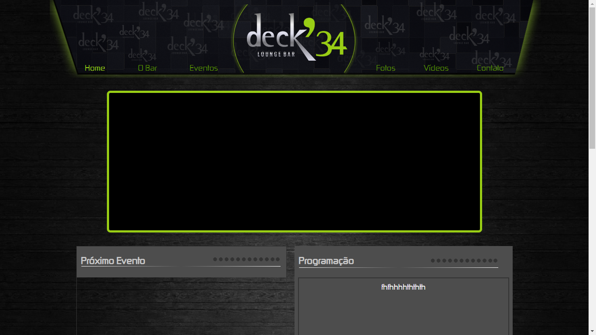
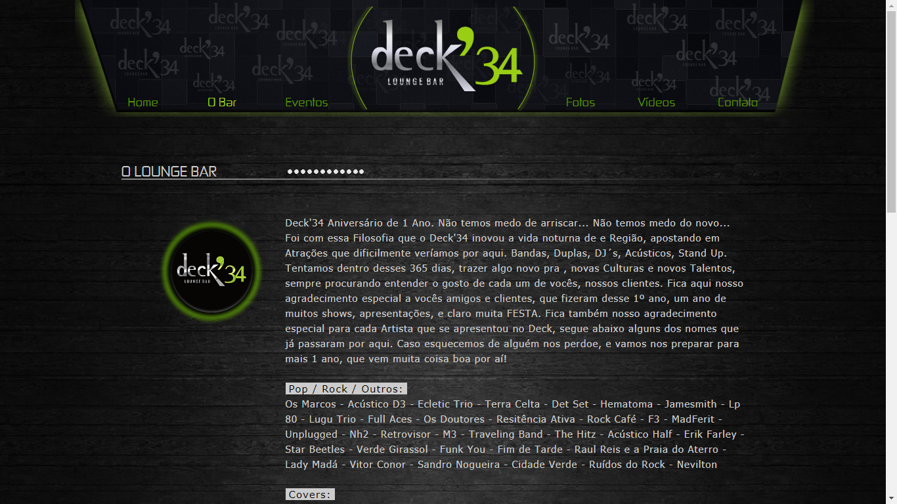
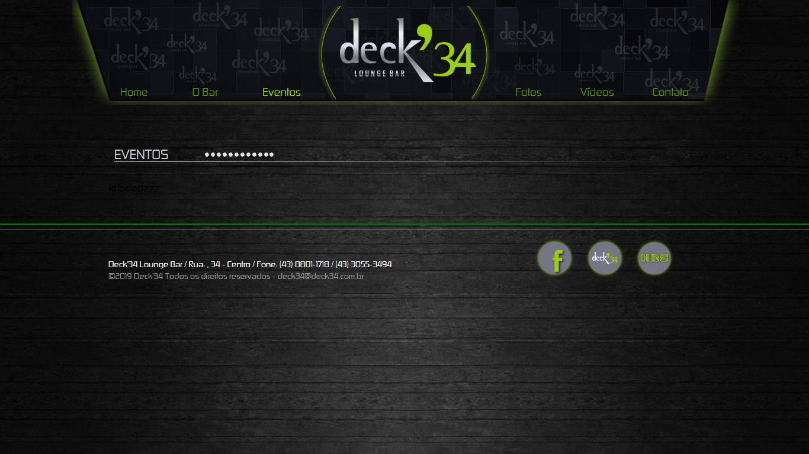
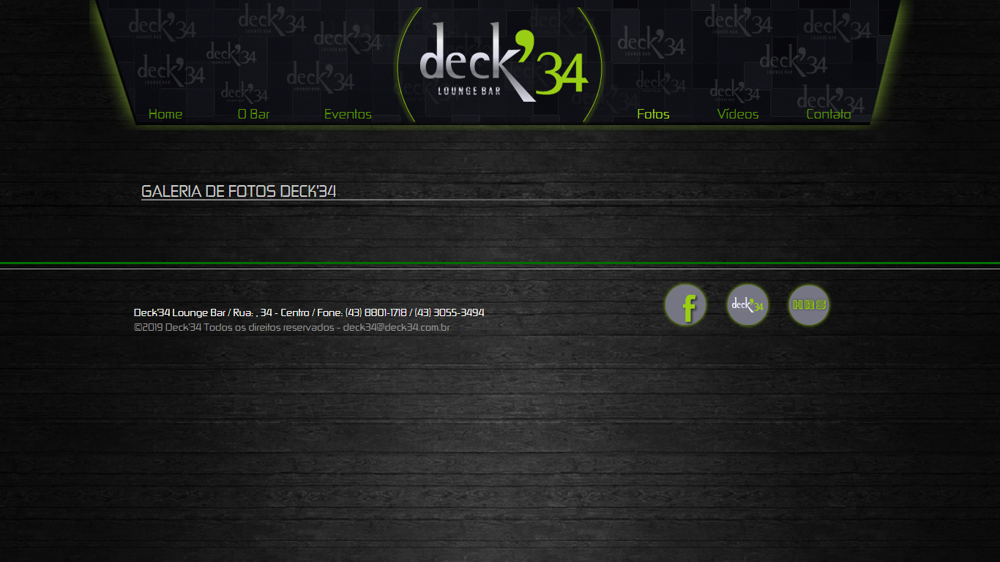
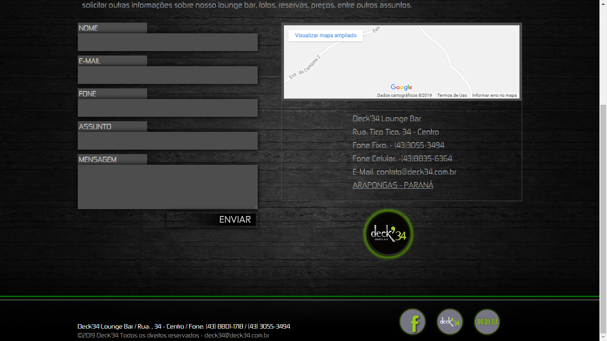
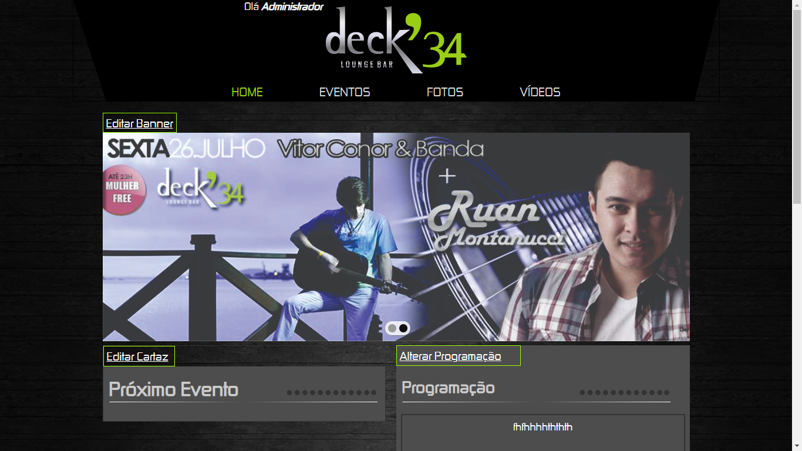
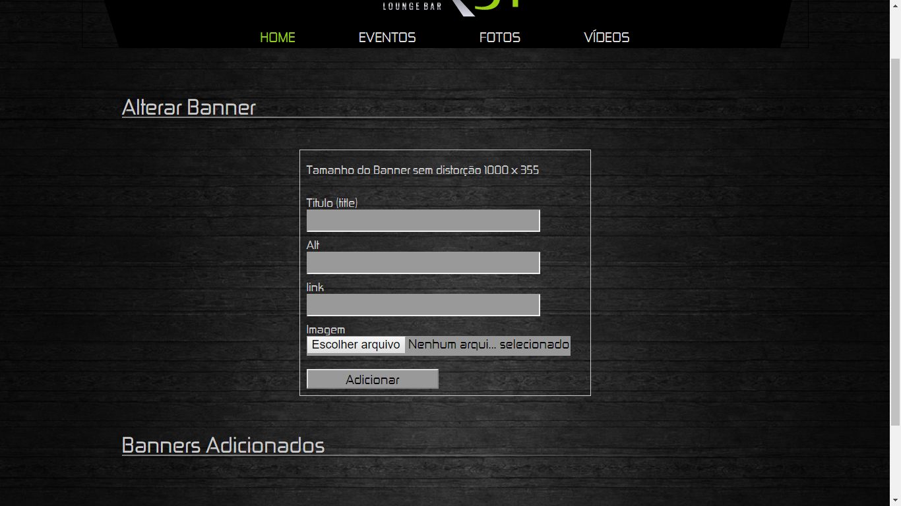

# Site-Boate
Site desenvolvido em meado de 2012 trabalhando profissionalmente

Site feita para uma boate com Painel administrativo para admin e usuário cadastrar galeria programado por mim do zero desde o front-end ao back-end em PHP, onde foi de extrema importância o meu aprendizado.
De forma estrutural onde tentava sempre inovar da minha maneira, hoje em dia claro que não é uma boa prática o metodo e a maneira
como foi programado, mas na época foi muito importânte para mim testar novos conhecimentos e o mais importante, ajuando o usuário final.

# Configuração

- A pasta SQL BANDO DE DADOS contém o arquivo .sql do banco de dados (Mysql).
- Altere o arquivo connect.php que está dentro de deck34admin/util e deck34usuario/util
- Para se logar altere as credenciais do arquivo authorize.php que esta dentro da pasta deck34admin/util e deck34usuario/util

       
